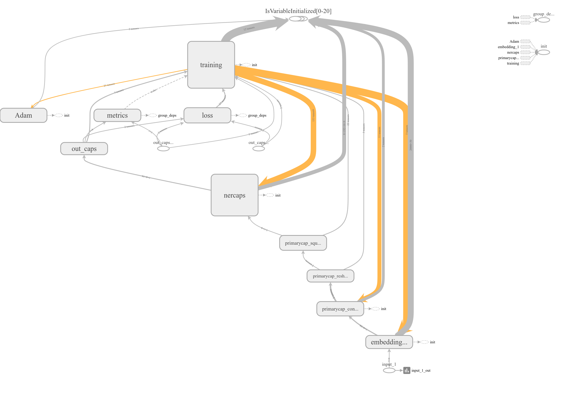

# CapsRoute_NER
Capsule Routing for Named Entity Recognition

# Model

# Dataset

-> Conll2003: dev, train, test 

-> Rotten Tomatoes Dataset: train, test

# Results

|       Model        |       CoNLL-2003       |     Rotten Tomatoes Dataset     | Validation Accuracy |
|--------------------|------------------------|---------------------------------|---------------------|
| CapsNet            |   :heavy_check_mark:   |     :heavy_multiplication_x:    |        96.47        |
| CapsNetGRU+FastText|:heavy_multiplication_x:|        :heavy_check_mark:       |        85.86        |          
| CapsNetGRU+Toxic   |:heavy_multiplication_x:|        :heavy_check_mark:       |        85.74        |
| BLSTM + CBOW       |   :heavy_check_mark:   |     :heavy_multiplication_x:    |        89.65        |
| BLSTM + Skipgram   |   :heavy_check_mark:   |     :heavy_multiplication_x:    |        89.78        |
| BLSTM+FastText     |   :heavy_check_mark:   |     :heavy_multiplication_x:    |        89.72        |
| BLSTM+Glove6B50d   |   :heavy_check_mark:   |     :heavy_multiplication_x:    |        97.17        |
| BLSTM+Glove6B200d  |   :heavy_check_mark:   |     :heavy_multiplication_x:    |        97.52        |
| BLSTM+Glove6B300d  |   :heavy_check_mark:   |     :heavy_multiplication_x:    |        97.60        |
| BLSTM+Glove42B300d |   :heavy_check_mark:   |     :heavy_multiplication_x:    |        97.75        |
| BLSTM+Glove840B300d|   :heavy_check_mark:   |     :heavy_multiplication_x:    |        97.01        |
